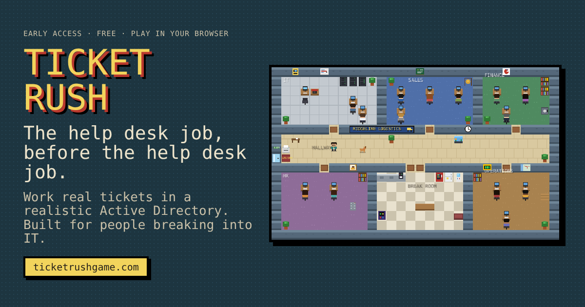

# Ticket Rush

**The help desk job, before the help desk job.**

▶ **Play free at [ticketrushgame.com](https://ticketrushgame.com)**

Ticket Rush is a retro, top-down IT simulator for people breaking into tech. You're the new Tier 1 tech at Ridgeline Logistics: answer calls, help coworkers who walk up to your desk, and work tickets in a realistic Active Directory Users and Computers console and a ServiceNow-style ticketing system called FixFlow.

## What you'll learn

- Password resets, lockouts, and verifying who you're talking to
- Onboarding, transfers, rehires, returns from leave, and offboarding
- Security groups vs. distribution lists, OUs, and Group Policy basics
- Spotting social engineering and password sprays
- Least privilege, approvals, and writing clear, safe ticket notes

## Features

- Two Tier 1 days with 18 tickets, each graded on the fix, security, your note, and how you treated the user
- Beginner, Standard, and Expert difficulty, a guided tour, and KB articles
- Autosave, so you can pick up where you left off
- More roles on the way: Desktop Support, Systems Administrator, Network Technician, and SOC Analyst

## Follow development

Instagram: [@ticketrushgame](https://instagram.com/ticketrushgame)

## Credits

Created by **AmirHussein Akhwand**.

Ridgeline Logistics and its employees are fictional. Ticket Rush is a training simulation and is not affiliated with Microsoft or ServiceNow. Active Directory is a trademark of Microsoft.

© 2026 AmirHussein Akhwand. All rights reserved.
